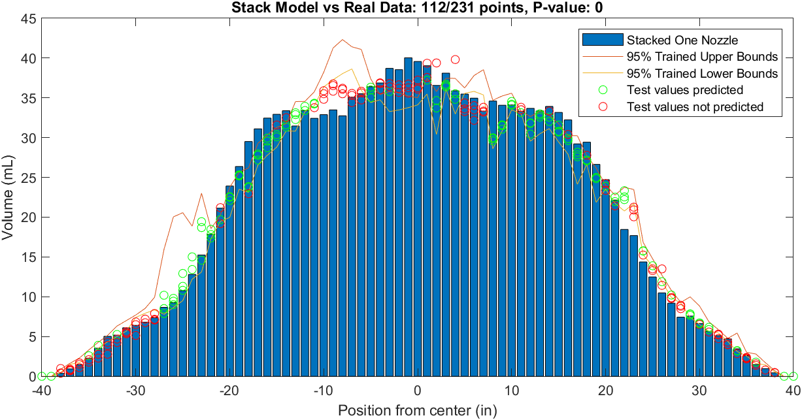

### My Goal

Mass application of herbicide is a cornerstone of modern agriculture, allowing weed control over larger and larger acres. However, overapplication in the last few decades is costing unnecessary amounts to farmers as well as contaminating freshwater lakes, streams and rivers. USDA estimates put herbicide drift in particular as responsible for over 55% of these sources being contaminated. In order to reduce the necessary application rates of herbicide, modeling the distribution of spray is done to simulate how much liquid will be applied upon detection of a weed. To do this, and avoid having to simulate every amount of nozzles individually, one such method is to take the distribution of one nozzle and simply 'stack' them, or place a distribution centered at each nozzle location and sum overlapping data. Error between this method and actual results with these nozzle amounts is expected, and for this study my overall question is: *"Is error between modeled spray and real spray significant?"*, with the follow-up of *"If so, is the error predictable and repeatable based on location?"*

## Materials
[Here](NozzleBootstrap.m) is the MATLAB code used to run the analysis

[Here](Patternator1DataSheet.xlsx) is the datasheet used. This folder needs to go in MatLAB folder or whatever directory is currently on the MATLAB path. 

While there is data for a combination of nozzles, heights and amounts, at the moment only the F8003 nozzle at 30" Height and 15" Spacing contains enough samples to run a good analysis for a 3-nozzle setup. When editing the code and changing inputs, change information in the "Input" tab in the data sheet. The code utilizes these inputs to index search the table  

## Analysis

*Sample mean distribution plots*

The first output of the code is taking the mean of the individual samples in each column. Since there are three nozzles at 15" Spacing, the model emulates a nozzle at -15", 0" and 15", done by shifting the 1" matrix columns accordingly during calculation. This gives a quick visual cue of the true data peaking off to the left of center, but for more meaningful numbers we will get the errors of individual samples as percentages, where (Error %) = ((Stacked Data)-(Real Data)/(Real Data)), with divide by zero columns being ignored. The results for the first three samples are shown here

This will be our "training" data that gets three values for expected error at each location. For the farther values, the errors can seems alarmingly high, but that is because they are relative to very small values. (e.g. if the true data is .7 mL and the stacked data is 1.0 mL, this would record a nearly 50% error) but the inner values seem to oscillate between -20% and +20%. Interestingly, the data *roughly* follows a sort of sinusoidal oscillation, so a sine function regresssion fitting was done as follows.


However, trying to find the error behavior is only useful if the error behavior is consistent and can be corrected. To do this, I took the three samples of error and bootstrapped the data, simulating the mean of 1,000 samples from this "population". Using an assumed t-distribution, a 95% CI was constructed for the error at each point. This confidence interval was then converted into an expected three-nozzle distribution bounds, and all three sets of training data were evaluated to see the accuracy of these bounds.



## Welcome to GitHub Pages

You can use the [editor on GitHub](https://github.com/basuby/516x-website/edit/gh-pages/index.md) to maintain and preview the content for your website in Markdown files.

Whenever you commit to this repository, GitHub Pages will run [Jekyll](https://jekyllrb.com/) to rebuild the pages in your site, from the content in your Markdown files.

### Markdown

Markdown is a lightweight and easy-to-use syntax for styling your writing. It includes conventions for

```markdown
Syntax highlighted code block

# Header 1
## Header 2
### Header 3

- Bulleted
- List

1. Numbered
2. List

**Bold** and _Italic_ and `Code` text

[Link](url) and 
```

For more details see [Basic writing and formatting syntax](https://docs.github.com/en/github/writing-on-github/getting-started-with-writing-and-formatting-on-github/basic-writing-and-formatting-syntax).

### Jekyll Themes

Your Pages site will use the layout and styles from the Jekyll theme you have selected in your [repository settings](https://github.com/basuby/516x-website/settings/pages). The name of this theme is saved in the Jekyll `_config.yml` configuration file.

### Support or Contact

Having trouble with Pages? Check out our [documentation](https://docs.github.com/categories/github-pages-basics/) or [contact support](https://support.github.com/contact) and we’ll help you sort it out.


